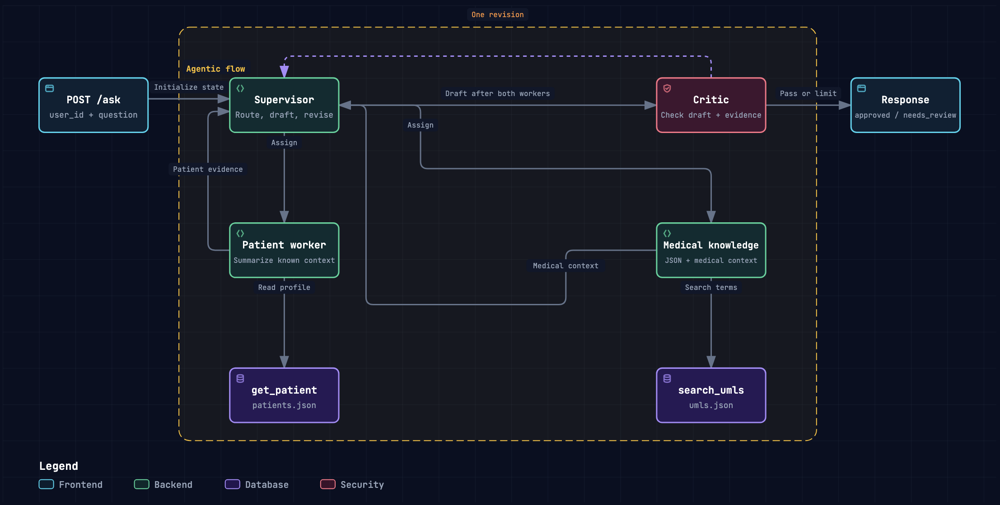

# Medical agent orchestration, kept small

A teaching backend with FastAPI, four LangGraph nodes, two model configurations, and two real MCP tools. Fictional records only. This is not a clinical tool and it has no authentication. Read `graph.py` first to follow the orchestration.



| File | Purpose |
| --- | --- |
| `main.py` | FastAPI endpoint, two model clients, MCP connection |
| `graph.py` | Supervisor, patient worker, terminology worker, critic |
| `mcp_server.py` | Two read only tools served over MCP stdio |
| `data/patients.json` | Fictional profiles and known conditions |
| `data/umls.json` | Ten synthetic terminology concepts |
| `docs/orchestration.html` | Interactive medical workflow diagram |
| `docs/orchestration.workflow.json` | Source for that diagram |
| `docs/blog.md` | Walkthrough for other developers |

## Run

Requires Python 3.11 or newer, [uv](https://docs.astral.sh/uv/), and a running [Ollama](https://ollama.com) server.

```sh
uv sync --locked
cp .env.example .env
ollama pull medgemma1.5
```

Set `DEEPSEEK_API_KEY` in `.env`. That file is gitignored. Do not commit it. `MAIN_MODEL` is used by the supervisor and patient worker. The default is `deepseek-flash` on the DeepSeek API. `CRITIC_MODEL` serves both the medical knowledge worker and the critic in separate calls. It must name a different model. The default is `medgemma1.5`, served by local Ollama.

```sh
uv run uvicorn main:app --reload
```

Open [the API explorer](http://127.0.0.1:8000/docs). FastAPI starts and stops the MCP subprocess automatically. No separate database or MCP terminal is needed.

Open [live orchestration](http://127.0.0.1:8000/live) to run a request beside the Archify diagram. The active node has a gold outline and an ACTIVE label, with the current step displayed above the diagram. The panel shows node starts, completions, elapsed time, and critic feedback, with expandable JSON events. Highlights clear on completion, failure, or Stop. Stop disconnects and cancels the run. Nothing is persisted, and no frontend dependencies are needed.

`POST /ask/stream` accepts the same input as `/ask` and returns newline-delimited JSON (`application/x-ndjson`). Events have `type: started`, `progress`, `result`, or `error`, plus request-relative `elapsed_ms`. Progress events identify the node and status; critic completions include the verdict, draft number, and feedback. The final result contains the same answer fields as `/ask`. Invalid input returns HTTP 422 before streaming; model failures and timeouts become terminal `error` events after HTTP headers have been sent. Internal graph state and unfinished drafts are not streamed.

```sh
curl -N http://127.0.0.1:8000/ask/stream \
  -H 'Content-Type: application/json' \
  -d '{"user_id":"demo-001","question":"Explain asthma."}'
```

```sh
curl -s http://127.0.0.1:8000/ask \
  -H 'Content-Type: application/json' \
  -d '{"user_id":"demo-001","question":"What does asthma mean, and is it in my known conditions?"}'
```

Try `demo-002` with a question about hypertension. Try an unknown user or a term such as migraine to demonstrate missing evidence. Matching uses complete names or aliases in the question, without semantic search or negation detection. A term match is never evidence that the patient has that condition.

## Follow one request

1. FastAPI creates fresh state from `user_id` and `question`.
2. The supervisor model chooses which worker goes first.
3. That worker retrieves evidence through MCP. The patient worker summarizes recorded facts with the main model. The medical knowledge worker (`terminology_worker` in Python) uses MedGemma to explain retrieved terms and add general medical information.
4. The supervisor dispatches the other worker. Python prevents repeated retrieval.
5. With both results available, the supervisor combines recorded facts and model-generated medical context into a draft.
6. The critic model reviews the exact draft against raw evidence and medical context, checking uncertainty and the distinction between retrieved facts and model suggestions.
7. Approval ends the graph. Rejection sends feedback to the supervisor for one revision. A second rejection ends with `needs_review` and `answer: null`.

Workers run sequentially, making dispatch and return easy to follow. Each worker has a fixed tool call in Python. This example demonstrates model-directed worker ordering and critique, without an additional autonomous tool selection loop.

The response contains `status`, `answer`, `feedback`, `drafts`, `trace`, `evidence`, `model_context`, and a demo notice. `evidence` contains only tool results. `model_context` has `source: model_generated` and the medical model's text, which is unverified model output rather than retrieved evidence. `trace` is a short execution log, not hidden model reasoning. A successful run with the patient worker first has these events.

```json
[
  "supervisor: dispatch patient_worker",
  "patient_worker: get_patient via MCP",
  "supervisor: dispatch terminology_worker",
  "terminology_worker: search_umls via MCP + medical model context",
  "supervisor: draft 1",
  "critic: approved"
]
```

The first approved draft normally takes five model calls. A revision adds two more. Critic feedback is schema-bounded to 240 characters. If a review hits the output token limit, that review is retried once with a compact-output instruction and the same draft and evidence. A second truncation remains an error, never an approval. A retry adds one model call without rerunning tools or drafting. The tools run once each. Evidence remains in memory for the request and is returned for teaching. There is no persistent conversation or checkpoint database.

For a question such as "I have fever, headache, nausea what could be wrong", a name-and-alias lookup may return no terminology matches. That no longer blocks general medical information: MedGemma can suggest cautious possible causes, ask clarifying questions, and describe relevant warning signs. The supervisor combines that context with the fictional record, without treating recorded conditions as the explanation for new symptoms. Empty retrieval stays empty, and model suggestions never gain invented `DEMO-*` IDs. This is prompt-guided behavior, not a guarantee of medical accuracy. MedGemma generates and reviews in separate calls using the same model, so the review is not independent clinical validation. See Google's [MedGemma model card](https://developers.google.com/health-ai-developer-foundations/medgemma/model-card) for intended use and limitations.

## Verify without the models

```sh
uv run pytest -q
```

The suite replaces model responses with scripts, but exercises the actual API, compiled graph, MCP session, subprocess, and JSON tools. It covers both worker orders, approval, revision, the rejection limit, unknown records, absent concepts, invalid input, errors, and request isolation. It does not measure model quality or clinical accuracy.

The MCP SDK is deliberately constrained to its 1.x API, which supplies the `FastMCP` and `ClientSession` interfaces used here. `uv.lock` records the dependency versions tested together. See the [official MCP SDK documentation](https://github.com/modelcontextprotocol/python-sdk/tree/v1.x) for this API line.

## Scope of the demo

`docs/orchestration.html` is generated from `docs/orchestration.workflow.json`. The live page updates role labels for the medical knowledge worker and its model context at runtime, without rewriting that file.

The JSON terminology file is not a UMLS export. Its `DEMO-*` identifiers are invented, and its short definitions are teaching fixtures. The NLM describes the actual [UMLS Metathesaurus](https://www.nlm.nih.gov/research/umls/knowledge_sources/metathesaurus/index.html), which has a much broader scope.

Use fictional records only. This local demo accepts a caller-supplied user ID without authentication and sends retrieved evidence to the DeepSeek API and the local MedGemma model. A critic approval is a model judgment, not clinical validation. This example should not be deployed with real patient records as written.

HTTP 422 means invalid input. HTTP 502 means a model or MCP failure. HTTP 504 means the graph exceeded its request time limit. `needs_review` is a completed graph with an unapproved result, not an HTTP transport failure and not a queued human review service.

## License

[MIT](LICENSE).
